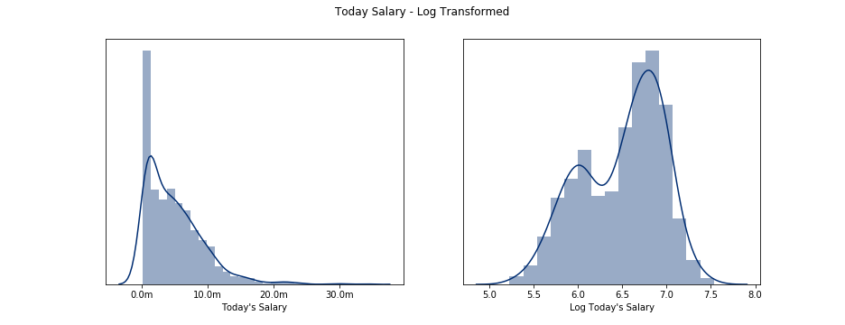
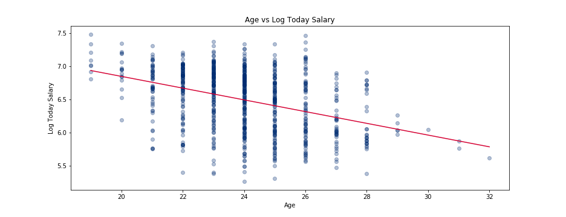
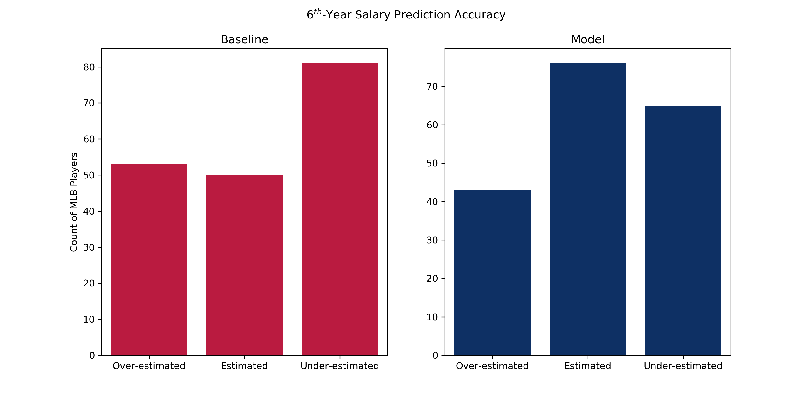

Ahh it's October, and there is no better time to talk about baseball than now! Baseball is such a great sport with a wonderful history and a plethora of statistics to assess the performance of each player and team. Each and every team faces a dilemma where the spends significant amount of time, effort, and capital in developing talent, but teams more often than not lose their talent to free agency in 6 years time. How does a team retain this talent? Specifically, can the salary in year 6 be predicted with only rookie year stats?

<!-- I decided to tackle a fundamental question related to baseball, how do you keep your top talent longer? -->

<!-- The current [CBA](http://m.mlb.com/glossary/transactions/free-agency) allows a player to enter free agency after 6 years of "service". I was curious if whether rookie stats alone colud predict a player's salary in their 6th season. If the salary could be predicted, then this information could be utilizied in year 3 or 4 to offer a contract to an oragnization's top talent. This is not 
I approached this broad topic with a focus on how can a MLB organization smartly offer a young player a contract to keep them longer than the minium 6 years. The 6 years threshold is related to the most recent [CBA](http://m.mlb.com/glossary/transactions/free-agency) defining free agenct. Specifically, can the salary in year 6 be predicted with only rookie year stats? -->

This is my second project as I continue down my 12-week journey in the immersive [Metis Data Science](https://www.thisismetis.com/data-science-bootcamps) program. First, we will review the motivation for why this question is of value, then how I went about answering questions, the results of my analysis, and next steps to extend the analysis.

# Motivation

Free agency is a hot topic as we are about to enter the 2019 off-season with top names like Manny Machado and Bryce Harper becoming free agents. Bryce Harper, of the Nationals, has received most of the attention as pundits are predicting a 35M salary in 2019 and a 400M total contract value, which would be a league record! It is highly unlikely the Nationals will be able to pay this price tag, and keep their other marquis players signed during previous free agency years, i.e. Max Scherzer. Ultimately, the Nationals will lose Bryce Harper and this will most likely have an adverse impact on them returning to post-season baseball anytime soon. What if the Nationals could turn back time, assess Bryce Harper's value during his rookie year, and develop a strategy to sign Bryce Harper prior to him leaving through free agency? This idea is not unprecedented and has occurred for other marquis players. Anthony Castrovince has a great [article](http://www.sportsonearth.com/article/264873218/mlb-hot-stove-free-agents-earlier-extensions) on this topic, and encourage you to read it for further background. What if you could predict salary in year 6 with rookie stats?

# Methodology

There were two main phases to my methodology, data acquisition and modeling / analysis. First, let's review how the data was acquired, filtered, and transformed for the model.

## Data Acquisition

I gathered data by scraping [BaseballReference](https://www.baseball-reference.com/) and gathered all rookie players, their stats, and salary data from 1985 - 2017. The data were filtered further down to focus only on non-pitchers, traditional offensive statistics, e.g. HR, H, 2B, 3B, etc., and only those players who played for at least 6 years. This added bias to my model as I was only looking at players who were "good enough" to play in the MLB for 6 years, and there is no great way of knowing whether a rookie today will continue to play in 6 years time. The model expects some expert assessment on whether or not the rookie player in question is capable of sustaining at least a 6 year career. Data were acquired, and now transformations were needed prior to running and selecting the best linear model to fit the data.

First, the salary in year 6 was heavily skewed right, which is typical as there are very few high-earners compared to average earners. The salary data was log transformed to account for skewness. You can see this in the plot below.

Next, the feature set was selected which are listed below.

|Feature|Description
|---|---|
|HR |Home runs|
|H |Hits|
|R |Runs|
|SB |Stolen Bases|
|TB |Total Bases|
|2B |Doubles|
|3B |Triples|
|RBI |Runs batted in|
|BB |Walks|
|SO |Strike outs|
|G |Games|
|PA |Plate appearances|
|AB |Official at bats|
|age |Age during rookie year|

Age was added to the feature set as there was a slight negative correlation between age and salary, and thus could have some influence on predicting salary. This is natural as the older a player is during their rookie year, then less potential value the player could have in year 6.

We now have basic definitions of what we are attempting to predict, log salary in year 6, and the set of features we expect to have predictive power. Let's now move on to the model selection process.

## Modeling / Analysis

The goal of my model is to answer, "What is the salary in year 6 based upon rookie year stats?" I utilized linear regression model to answer this question. This section will get technical, so please feel free to skip ahead to the [Results](#results) section if you are less technically inclined.

The data was split into tran/test data sets using random sampling. The train data set represented 80% of the sample, and test data set represented 20% of the sample. Three different classes of models were considered and all compared via out-of-sample error using a 10-fold cross validation. The three types of models were,

|Model Type|
|---|
|Linear (OLS)|
|Feature Standardization + Lasso regularization|
|Polynomial features + Feature standardization + Lasso Regularization|

The results and ranking of each different type of model is described below.

|Rank |Model |Polynomial Deg.|Lambda|RMSE|
---|---|---|---|---
|0 |Lasso |3 |0.01 |0.401520
|1 |Lasso |2 |0.01 |0.401682
|2 |Lasso |4 |0.01 |0.401850
|3 |Lasso |5 |0.01 |0.402899
|4 |Lasso |NA |0.01 |0.403164
|5 |Linear |NA | NA|0.403841

Utilizing a simple grid search algorithm the model with 3rd degree polynomials (and interactions) plus feature standardization and lasso regularization resulted in the smallest error.

#  Results

We have this nice model, but what does this actually mean for an executive or GM for an MLB team? Let's first consider a simple baseline model of whatever players have made historically in year 6, on average, in the MLB between 1985 - 2017 is most likely what any rookie will make in year 6. We can now use this baseline model to compare the accuracy of the baseline model to the linear model I created to predict salary in year 6. We are going to compare the two models by grouping the prediction error into 3 groups,

|Group | Description|
|---|---|
|Over-estimated | The model predicted a salary which is at least 50% higher than actual salary.
|Estimated | The model predicted a salary that is within 50% of the actual salary.
|Under-estimated | The model predicted a salary which is at most 50% lower than actual salary.

194 randomly selected players were held out from training the model, and the comparison of the two groups can be summarized in the chart below.

You can see the bucket of estimated salaries grew from the baseline model to the model I created. This is good news as it shows there is a statistically significant signal when utilizing a feature set consisting of traditional offensive statistics. The buckets of over-estimated and under-estimated in the linear model are still quite large which means there is some variance in the prediction of year 6 salary which is not explainable by traditional offensive statistics.

# Future Work

What could be considered to improve the overall accuracy of this initial model. Here are some next steps which could add value to the current model.

* Include new saber metric / statcast statistics as features in the model, e.g. WAR, exit velocity, launch angle, etc.  
* Segment data by position. Typically, Catchers or Shortstops do not necessarily have as high traditional offensive statistics compared to Outfielders or First Basemen, and thus could cause conflating signals when attempting to predict salaries.  
* Include the first 2 years of a player's career, instead of just the first year. There isn't much history, if at all, of a player receiving a contract after their rookie year. Including multiple years of data could potentially smooth out erratic rookie performance in first or second year of their career.

Hope you enjoyed this high-level summary and if interested you can see all of the detailed code in my github [repository](https://github.com/jason-sa/baseball_lin_regression)

# Next Project

I am now moving onto my next project which is a classification problem based on e-commerce data. If you are interested, then you can check out the [repository](https://github.com/jason-sa/classification) with the project proposal. You can expect a new blog post by early November summarizing this project.